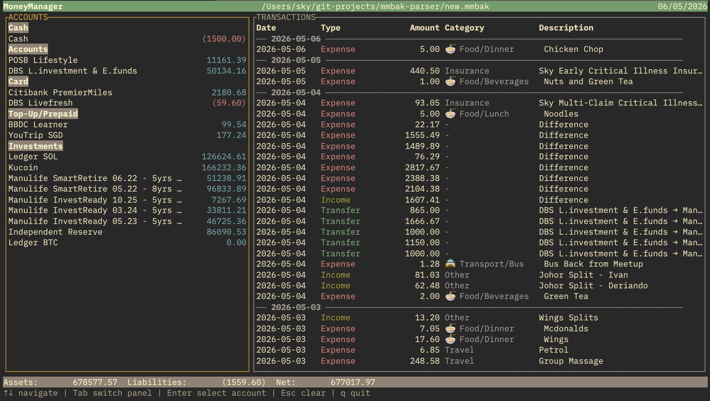

# mmbak

[](https://www.rust-lang.org/)
[](LICENSE)

A terminal viewer for **MoneyManager** `.mmbak` backup files. Browse your accounts, transactions, and balances in an interactive TUI — or sync account balances directly to Google Sheets.



---

## Features

- **Interactive TUI** built with [ratatui](https://github.com/ratatui/ratatui)
- **Grouped accounts** — Cash, Cards, Investments, etc. with real-time calculated balances
- **Date-divided transaction list** — each day starts with a visual divider row
- **Merged transfer rows** — `TransferOut` + `TransferIn` pairs shown as a single `From → To` row
- **Accounting-style negatives** — debits shown as `(1,234.56)` instead of `-1,234.56`
- **Category hierarchy** — `Parent/Sub` format (e.g. `🍜 Food/Dinner`)
- **Account filtering** — select any account to show only its transactions
- **Google Sheets sync** — push balances to a spreadsheet via CLI (`sync-sheet`)

---

## Installation

Requires [Rust](https://www.rust-lang.org/tools/install) 1.85+.

```bash
git clone https://github.com/YOUR_USERNAME/mmbak-parser.git
cd mmbak-parser
cargo build --release
```

The binary is at `./target/release/mmbak`. Copy it to your `PATH`:

```bash
cp ./target/release/mmbak ~/.local/bin/
```

---

## Usage

### Open the TUI

```bash
mmbak path/to/backup.mmbak
```

### Sync balances to Google Sheets

```bash
# Preview what would change
mmbak sync-sheet --config sync_config.toml backup.mmbak --dry-run

# Apply changes
mmbak sync-sheet --config sync_config.toml backup.mmbak
```

Copy `sync_config.toml.example` → `sync_config.toml` and fill in your spreadsheet ID, service-account key path, and account mappings.

---

## Key Bindings

| Key | Action |
|-----|--------|
| `↑` / `↓` or `k` / `j` | Navigate in focused panel |
| `Tab` | Switch focus between Accounts ↔ Transactions |
| `Enter` | Select account → filter transactions to that account |
| `Esc` | Clear selection → show all transactions |
| `q` | Quit |

---

## About `.mmbak` Files

`.mmbak` is the SQLite backup format used by the [MoneyManager](https://www.realbyteapps.com/) mobile app (Android / iOS). This tool reads the raw database directly — no export or conversion needed.

---

## License

MIT © [Tan Yunliang](https://github.com/skypad123)
